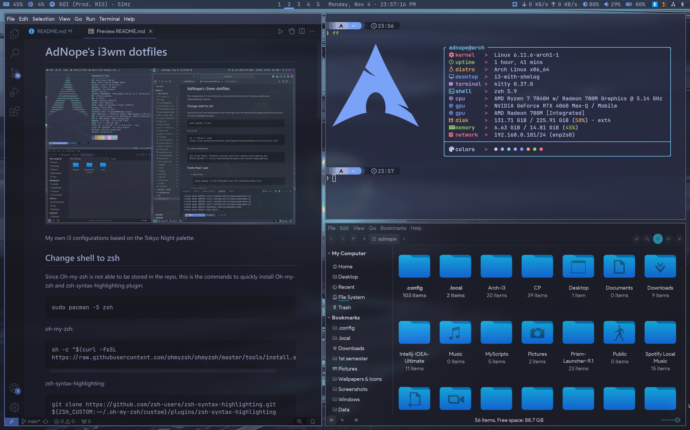

# AdNope's i3wm dotfiles



My own i3 configurations based on the Tokyo Night palette.

I recommend installing Arch with archinstall and KDE to start as KDE provides a very solid base for customizing and daily driving Arch.

## Change shell to zsh
Since Oh-my-zsh is not able to be stored in the repo, this is the commands to quickly install Oh-my-zsh and zsh-syntax-highlighting plugin:
```
sudo pacman -S zsh
```
oh-my-zsh:
```
sh -c "$(curl -fsSL https://raw.githubusercontent.com/ohmyzsh/ohmyzsh/master/tools/install.sh)"
```
zsh-syntax-highlighting:
```
git clone https://github.com/zsh-users/zsh-syntax-highlighting.git ${ZSH_CUSTOM:-~/.oh-my-zsh/custom}/plugins/zsh-syntax-highlighting
```

## Fonts that I use:
- Jetbrains Nerd Fonts:
    ```
    sudo pacman -S ttf-jetbrains-mono-nerd
    ```

- Product Sans:
    ```
    sudo cp Arch-i3/assets/fonts/product-sans/* /usr/local/share/fonts/ ttf/  
    ```

- Microsoft Fonts:

    According to Arch Wiki, this is how to get microsoft fonts from an existing Windows C Drive partition:
    ```
    sudo mount --mkdir /window_partition /run/media/adnope/Windows
    sudo mkdir -p /usr/local/share/fonts/WindowsFonts
    sudo cp /run/media/adnope/Windows/Windows/Fonts/*.ttf /usr/local/share/fonts/WindowsFonts/
    sudo chmod 644 /usr/local/share/fonts/WindowsFonts/*
    fc-cache --force
    ```

## Installing yay as AUR helper
```
pacman -S --needed git base-devel && git clone https://aur.archlinux.org/yay.git && cd yay && makepkg -si
```

## Packages and notes:

This repo contains config files for the following applications:
- dunst
- fastfetch
- greenclip
- i3
- ibus-bamboo (for vietnamese input)
- input-remapper
- kitty
- mangohud
- micro
- picom
- polybar
- rofi
- starship
- zsh (.zshrc)

Quick command to install all necessary packages:
```
sudo pacman -Syu blueman bluez brightnessctl dunst fastfetch feh ffmpegthumbnailer ffmpegthumbs kolourpaint ksnip network-manager-applet pavucontrol playerctl polybar rofi spotify-launcher starship stow unrar ark vivaldi vivaldi-ffmpeg-codecs xclip zsh libheif libpulse libraw libultrahdr libwmf lxappearance micro ntfs-3g power-profiles-daemon xorg-xinput xorg-xrandr

yay -S ibus-bamboo input-remapper-git qimgv-git rofi-greenclip visual-studio-code-bin picom-git
```

In addition, I included some of my own scripts here in 'MyScripts', and the GTK themes that I use.

### i3wm:
This is some steps to configure KWallet because Brave requires it, but now I don't use Brave anymore.
To unlock KDE wallet automatically on login, make sure these two lines are present in /etc/pam.d/sddm:
```
auth            optional        pam_kwallet5.so
session         optional        pam_kwallet5.so auto_start
```

Kde authentication agent:
```
sudo pacman -S polkit-kde-agent
```

Setting wallpaper:
```
sudo pacman -S feh
```

### Applets:
```
sudo pacman -S bluez blueman
sudo systemctl enable bluetooth
```

### Polybar:
In the backlight module, to allow changing brightness by scroll wheel you have to add the current user to the 'video' group and write a udev rule.

Adding user to 'video' group:
```
usermod -aG video $USER
```
Create the "/etc/udev/rules.d/backlight.rules" file. For my system using nvidia as the backlight vendor, it contains these lines:
```
ACTION=="add", SUBSYSTEM=="backlight", KERNEL=="nvidia_0", RUN+="/usr/bin/chgrp video /sys/class/backlight/nvidia_0/brightness"

ACTION=="add", SUBSYSTEM=="backlight", KERNEL=="nvidia_0", RUN+="/usr/bin/chmod g+w /sys/class/backlight/nvidia_0/brightness"

ACTION=="add", SUBSYSTEM=="backlight", KERNEL=="nvidia_0", RUN+="/usr/bin/chgrp video /sys/class/backlight/nvidia_0/actual_brightness"

ACTION=="add", SUBSYSTEM=="backlight", KERNEL=="nvidia_0", RUN+="/usr/bin/chmod g+w /sys/class/backlight/nvidia_0/actual_brightness"
```
This gives polybar the permission to change the 'brightness' and 'actual_brightness' files. If you don't use an nvidia card or use other backlight vendors, check out [Arch Wiki - Backlight](https://wiki.archlinux.org/title/Backlight#Udev_rule).

## GTK themes
I use LXappearance to quickly set GTK themes:
- General: Tokyo Night
    ```
    mkdir -p ~/.local/share/themes && cp -r ~/Arch-i3/assets/gtk-themes/Tokyonight-Dark ~/.local/share/themes
    ```
- Icons: Kora
    ```
    mkdir -p ~/.local/share/icons && cp -r ~/Arch-i3/assets/gtk-themes/kora ~/.local/share/icons
    ```
- Mouse cursor: Future-dark
    ```
    cp -r ~/Arch-i3/assets/gtk-themes/Future-dark-cursors ~/.local/share/icons
    ```
- Font: Product Sans Regular 12